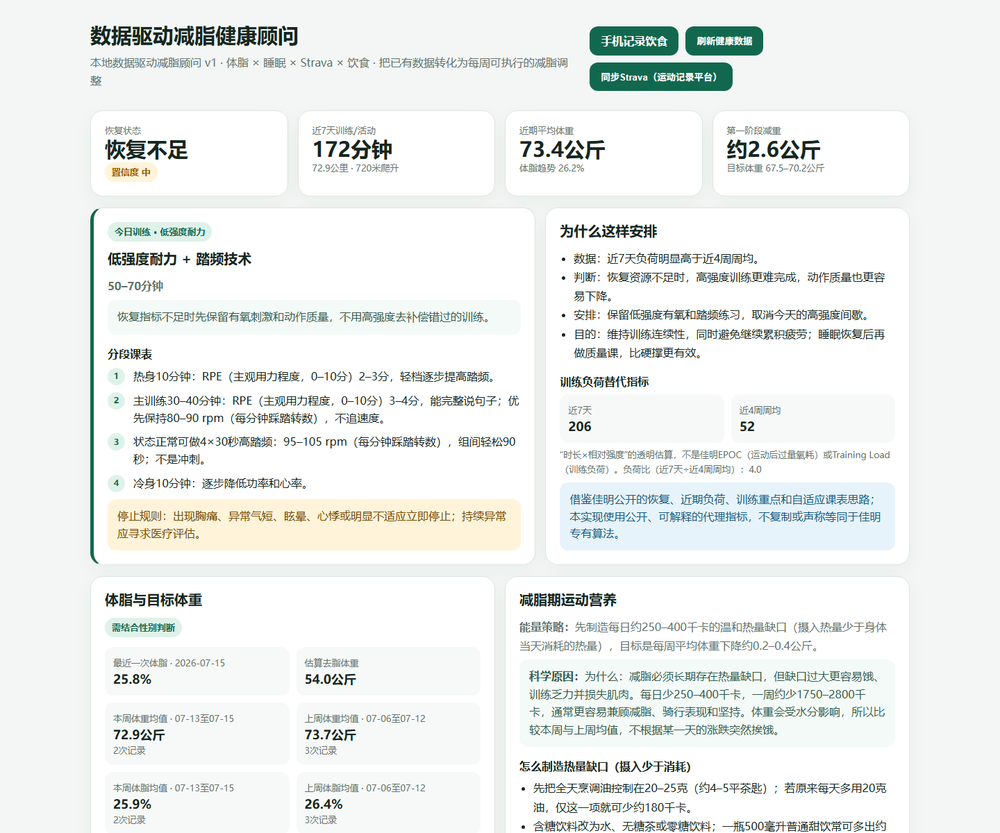
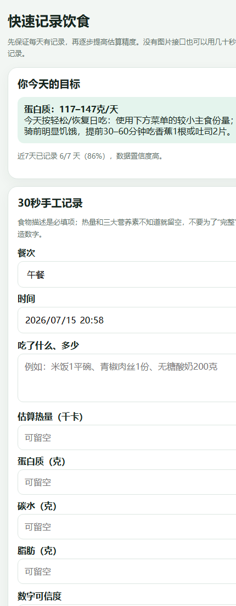

# Health Advisor

**Local-first data-driven fat-loss advisor.**

把体脂、睡眠、Strava 运动和饮食数据转化为每周可执行的减脂调整。

> 这不是“小米数据采集工具”的另一个外壳。小米健康数据只是输入之一；项目的核心价值是帮助用户发现体重/体脂停滞的原因，并把下一周该怎么吃、怎么练、怎么恢复说清楚。

## 合成数据演示



<p align="center"></p>

> 两张截图全部使用合成数据，不包含真实体重、体脂、饮食、token 或数据库内容。

## 目标用户

最适合以下用户：

- 已经使用小米体脂秤、手环/手表，并在 Strava 留下运动记录；
- 目标是减脂，但数据分散在多个应用里，无法形成统一判断；
- 经常称重、运动，却不知道平台期来自饮食、恢复、活动量还是测量波动；
- 接受本地部署，重视健康数据和登录凭据不上传到第三方服务。

当前不是医疗诊断工具、通用医院健康平台或多人 SaaS，也不承诺自动、无误差地识别所有饮食。

## 真正要解决的问题

减脂不是“再多采一个设备数据”就能完成。自动数据中，体重、睡眠和运动相对容易获得，**每天到底吃了什么、吃了多少**才是最大的缺口。

因此项目同时提供两种记录路径：

1. **30 秒手工记录：**食物描述必填，热量和营养素不知道就留空，不强迫用户编数字；
2. **照片辅助记录：**配置图片分析接口（`MEAL_LLM_API_KEY`）后，估算餐食组成并保留不确定性说明。

看板展示近 7 天饮食记录覆盖天数、条数和数据置信度。数据不足时只给目标，不假装能判断真实摄入。

## 核心能力

- 汇总小米体脂、睡眠、步数、心率、SpO2 和压力数据；
- 同步 Strava 活动、训练量与近期强度；
- 计算恢复状态、训练负荷、体重和体脂趋势；
- 快速手工记录或照片辅助记录饮食；
- 生成可解释的训练、饮食和恢复建议；
- 所有个人数据默认保存在本地 SQLite；服务绑定 `0.0.0.0` 以便手机局域网访问，非本机来源一律要求访问令牌（见下文"隐私与安全"）。

## 与 Mi Bridge 的关系

小米连接器已经拆分为独立项目：[Mi Bridge（米桥）](https://github.com/shkyyy18/mi-bridge)。

- **Mi Bridge（米桥）：**帮助用户拥有、导出和复用自己的小米健康数据；
- **Health Advisor：**把小米、Strava 和饮食数据组合起来，帮助用户真正执行减脂计划。

本项目不再复制或 vendor 小米连接器源码。桥接器是唯一连接器实现，健康顾问只把它作为数据源依赖。

## 架构

```text
Mi Fitness Data Bridge ─┐
                        ├─> 本地 SQLite ─> 可解释分析 ─> 每周行动建议
Strava API ─────────────┤
手工/照片饮食记录 ─────┘
```

- **Connector layer：**Mi Fitness Data Bridge、Strava；
- **Storage layer：**`data/health.db`，同一时间只允许一个写入者；
- **Analysis layer：**恢复、训练负荷、体重/体脂趋势、饮食覆盖度；
- **Presentation layer：**FastAPI 本地看板和手机饮食记录页。

## 安装

推荐把两个仓库放在同一个父目录：

```powershell
cd D:\CodexWorkspace\projects
git clone https://github.com/shkyyy18/mi-fitness-data-bridge.git mi_fitness_data_bridge
git clone https://github.com/shkyyy18/health-advisor.git health_assistant
cd health_assistant
python -m venv .venv
.\.venv\Scripts\Activate.ps1
pip install -e ..\mi_fitness_data_bridge
pip install -e ".[dev,xiaomi]"
```

> If you previously used `D:\AIWorkspace`, that path is a junction to the same location; the stable path is `D:\CodexWorkspace\projects\health_assistant`.

复制 `.env.example` 为 `.env`，填写本地配置，然后运行：

```powershell
.\run.ps1
```

本地看板：`http://127.0.0.1:8000/`

Public tunnels are **disabled by default**. The startup script only attempts to launch ngrok when `.env` explicitly contains `HEALTH_ENABLE_NGROK=true` and authentication, privacy, exposed routes, and log handling have been reviewed separately. Keep the value `false` for normal local use; a configured Strava callback URL alone must never enable public access.

## 首次连接小米

桥接器提供健康数据读取接口；当前二维码登录辅助脚本仍由本项目的 `mijiaAPI` 可选依赖提供：

```powershell
python scripts\mijia_health_sync.py login
python scripts\mijia_health_sync.py doctor
python scripts\mijia_health_sync.py sync
```

登录文件位于 `data\.mijia\auth.json`，包含敏感 token，不得上传、打印或分享。

## 每日自动同步

计划任务 `HealthAssistantDailySync` 每天 08:10 和 21:40 自动运行 `scripts\daily_sync.py`：通过本地服务接口同步小米 Mi Fitness（睡眠、体成分、日常指标）和 Strava 活动，结果写入 `logs\daily_sync.log`，任务返回码非 0 表示有失败项。`StartWhenAvailable` 会在开机后补跑错过的同步。

安装或卸载：

```powershell
powershell -NoProfile -ExecutionPolicy Bypass -File .\scripts\install_sync_task.ps1
powershell -NoProfile -ExecutionPolicy Bypass -File .\scripts\install_sync_task.ps1 -Uninstall
```

手工同步一次：`python scripts\daily_sync.py`。小米 token 过期时同步会失败，需要重新执行 `python scripts\mijia_health_sync.py login`。

## 饮食记录

打开 `http://127.0.0.1:8000/mobile`：

- 先查看今日联动教练、训练/恢复动作和随训练变化的一日菜单；
- 不配置图片分析接口也可以手工记录；
- 配置 `MEAL_LLM_API_KEY` 后可以上传餐食照片辅助估算（接口与模型见 `.env.example`）；
- 原始照片不会写入本地数据库，只保存文字分析和营养估算；
- 手工和照片估算都不是实验室测量，建议优先记录“吃了什么和份量”，再逐步提高数字精度。

## 测试

```powershell
python -m pytest -q -p no:cacheprovider
python -m py_compile app\analytics.py app\db.py app\main.py app\xiaomi_sync.py
```

测试会把数据库切换到临时目录，不会读写真实的 `data/health.db`。

## 隐私与安全

以下内容均被 Git 忽略，禁止提交：

- `.env`、访问 token、登录文件；
- SQLite 数据库、导出数据；
- 健康日志、餐食照片、运行日志；
- 包含真实个人指标的截图和测试夹具。

详见 `SECURITY.md`。

## 项目边界

- 内容用于个人运动和体重管理，不替代医生、注册营养师或持证教练的个体化评估；
- 不生成诊断或治疗建议；
- 不把历史观测最高心率冒充实验室最大心率；
- 数据不足时必须明确降低结论置信度。

## GitHub 双项目实验

桥接器和完整健康顾问都可以独立发布，由真实用户选择价值：

- Star 衡量传播；
- 安装、成功同步、Issue 和 PR 衡量生态价值；
- 7 天饮食记录、周报生成、4 周留存和建议执行衡量问题是否真正被解决。

详见 `docs/github-experiment.md`。

## 发布

版本变更见 `CHANGELOG.md`，GitHub 发布、服务切换和产品实验检查见 `docs/release-checklist.md`。

## License

MIT，见 `LICENSE`。第三方依赖和来源说明见 `THIRD_PARTY_NOTICES.md`。
